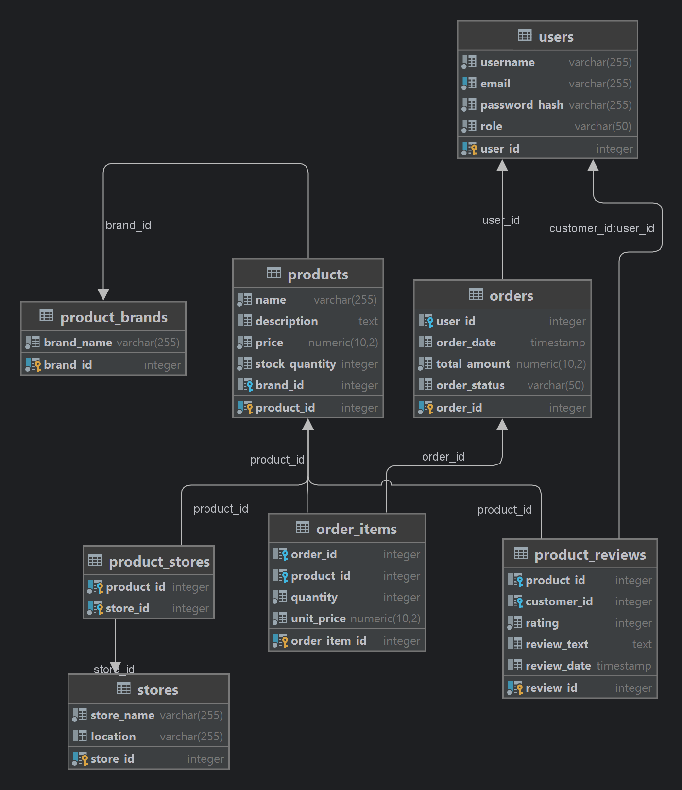

# Practice База данных

Задание 1. БД - придумать схему согласно теме проекта, 
минимум 7 таблиц, обязательное наличие связи многие ко многим. 
Необходимо использовать PostgreSQL.

Планируемое время 4 часа;
Фактическое время 4 часа;

    

